 

### О себе

Frontend-разработчик, **4+ года** в продакшене: от лендингов с рекордным SEO до аналитических панелей и AI-фич, которые кратно увеличивали вовлечённость. Закрываю фронт полностью — дизайн, анимации, тесты, часть backend/DevOps, когда это нужно проекту.

Сейчас развиваю **[Pockets Money](https://pockets-money.ru)** — личный финансовый помощник с AI-аналитикой (Nuxt 4 · NestJS · Prisma · Telegram-бот).

### Стек

 

 

### Опыт

**Frontend-разработчик · Network Group** · Май 2022 — настоящее время · 4+ года

> Два проекта на Vue 3/Nuxt и React/Next.js. Единственный frontend в команде — уложился в дедлайн, поднял SEO лендинга, внедрил AI-функциональность (продажи выросли кратно), довёл продукт до 90–100 баллов Lighthouse.

<b>Полный список задач и достижений</b>

 

**Проект 1 — Vue 3, Nuxt, NestJS, PostgreSQL**
- Аналитические панели и визуализация данных
- Feature-Sliced Design (FSD) для структурирования кодовой базы
- Сложный кастомный дизайн с насыщенной анимацией
- Доработка лендинга + локализация на несколько языков
- Технический аудит стороннего приложения по внутренней рекомендации
- Оптимизация производительности: lazy loading, мемоизация, виртуальный скролл
- Адаптивная вёрстка и кроссбраузерная совместимость
- Приём платежей, Telegram-бот регистрации и рассылок
- Unit/E2E-тестирование компонентов и бизнес-логики

**Проект 2 — React, Next.js**
- Frontend админки, лендинга и личного кабинета + часть backend-задач
- Storybook для UI-компонентов
- Линтеры, типизация, тестовое покрытие
- Техдокументация по контракту данных для backend-команды
- Крупная админ-панель с визуализацией метрик
- Telegram Mini App
- Редизайн приложения под актуальные тренды — вырос интерес и удержание

**Сквозное:** skeleton loading, оптимизация загрузки, unit/E2E-тесты как стандарт, инициатива по внедрению ретроспектив

**Frontend-разработчик (стажёр) · БИОКАД** · Февраль 2022 — Апрель 2022

> Веб-интерфейс на Angular/React для взаимодействия исследователей с оборудованием компании. Сократил время выполнения ежедневных задач пользователей на 30%.

### Статистика

 

